# PJ1 报告

本项目实现了：

- 分段三次 Bézier 曲线与三次均匀 B 样条曲线的离散化与显示
- 曲线局部坐标系（切向量 T、法向量 N、次法线/副法线 B）的计算与显示
- 旋转曲面（绕 y 轴）与广义圆柱面的网格生成（VV/VN/VF）与顶点法线计算

运行命令：

- 编译：`cmake --build build -j`
- 运行：`./build/a1 swp/<name>.swp`

交互按键（用于演示/截图）：

- `C`：切换曲线显示模式（无 / 曲线 / 曲线+TNB）
- `S`：切换曲面显示模式（无 / 曲面 / 曲面+顶点法线）
- `P`：切换控制点与控制多边形显示
- `Esc`：退出

说明：曲线为白色；曲线局部坐标系中 **N 红、B 绿、T 蓝**。

---

## 任务1：曲线绘制

### 1. 输入与离散化

`.swp` 文件中的曲线由控制点给出，并带有 `STEPS` 参数。实现中遵循框架约定：

- `STEPS` 表示 **每一段三次曲线 piece** 被离散成 `STEPS` 份（每段输出 `STEPS+1` 个采样点）。
- 对于分段曲线，段与段共享端点；实现中会跳过后续段的第一个采样点，避免重复顶点。

### 2. 分段三次 Bézier（evalBezier）

控制点满足 `P.size() = 3n + 1`，每四个控制点构成一段三次 Bézier：

$$
V(t)=(1-t)^3P_0+3(1-t)^2tP_1+3(1-t)t^2P_2+t^3P_3,\quad t\in[0,1]
$$

并使用一阶/二阶导数计算切向与曲率方向（用于法向）：

$$
V'(t)=3(1-t)^2(P_1-P_0)+6(1-t)t(P_2-P_1)+3t^2(P_3-P_2)
$$

$$
V''(t)=6(1-t)(P_2-2P_1+P_0)+6t(P_3-2P_2+P_1)
$$

### 3. 三次均匀 B 样条（evalBspline）

对每个连续的 4 个控制点形成一段（piece 数为 `P.size()-3`）。在 $u\in[0,1]$ 上采用均匀三次 B 样条基函数：

$$
\begin{aligned}
N_0(u)&=\frac{(1-u)^3}{6},\\
N_1(u)&=\frac{3u^3-6u^2+4}{6},\\
N_2(u)&=\frac{-3u^3+3u^2+3u+1}{6},\\
N_3(u)&=\frac{u^3}{6}.
\end{aligned}
$$

曲线位置 $V(u)=\sum_i N_i(u)P_i$，并用 $N_i'(u),N_i''(u)$ 得到 $V'(u),V''(u)$。

### 4. 局部坐标系 T/N/B（Frenet + 稳定处理）

每个采样点生成 `CurvePoint{V,T,N,B}`：

- $T=\mathrm{normalize}(V')$
- 初始法向候选：$N_\text{raw}=V''-\langle V'',T\rangle T$（将二阶导投影到法平面）
- $B=\mathrm{normalize}(T\times N)$，再用 $N=B\times T$ 回正保证正交

退化/稳定性处理：

- 若 $\|V'\|$ 很小：沿用上一点的 $T$（避免除零）。
- 若 $\|N_\text{raw}\|$ 很小（直线段或拐点附近曲率接近 0）：优先做“平移传输”——沿用上一点的 $B$，令 $N=B\times T$，避免法向随机旋转。
- 为避免 frame 翻转：若当前 $N$ 与上一点 $N$ 点积为负，则同时翻转 $N,B$ 保持连续。

特别重要的 2D 平面曲线处理：

- 旋转曲面/广义圆柱面要求 profile 曲线严格位于 xy 平面（框架会检查 `V.z/T.z/N.z`）。
- 因此对平面曲线强制选择 $B=(0,0,1)$，并令 $N=B\times T$，确保 $N.z=0$。

### 5. 结果截图

以下为各样例曲线与 T/N/B 显示截图（高分辨率图像见 `image/` 目录）：

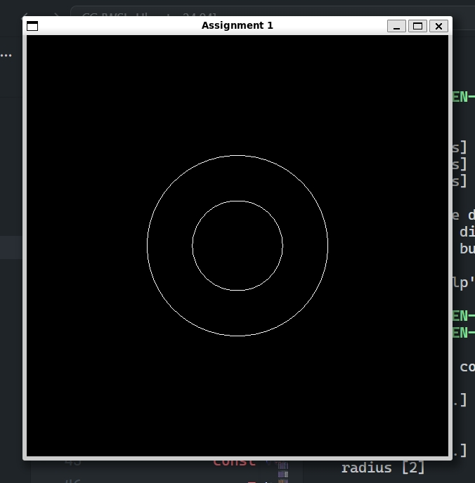

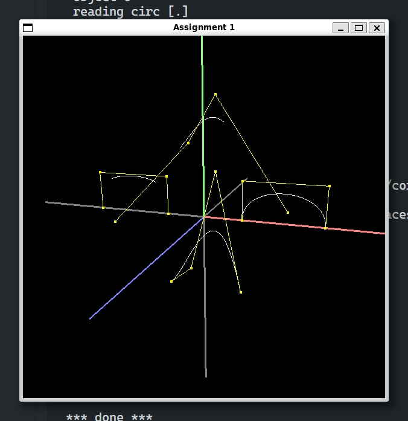

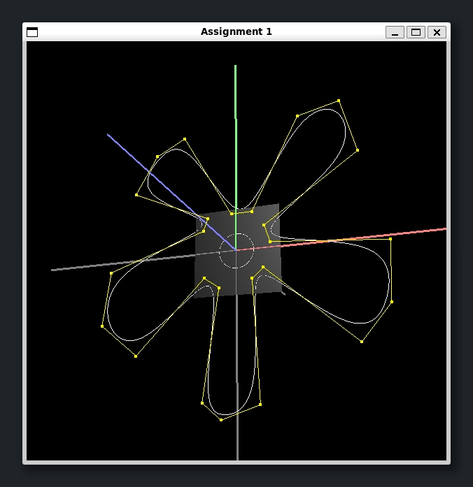

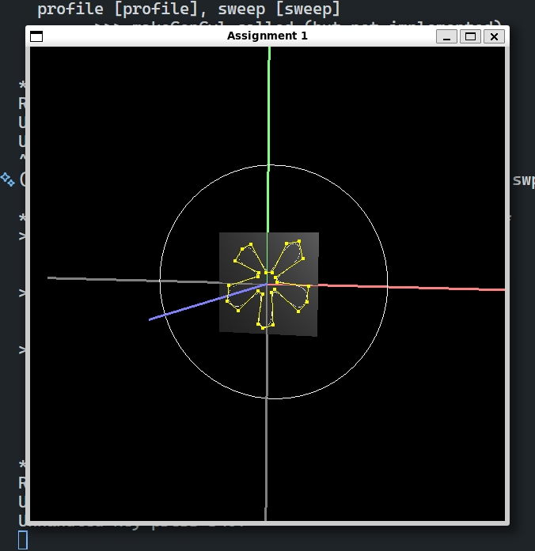

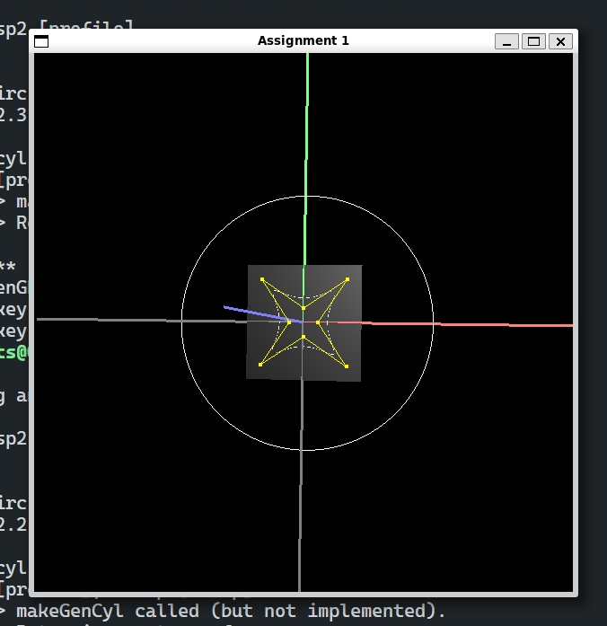

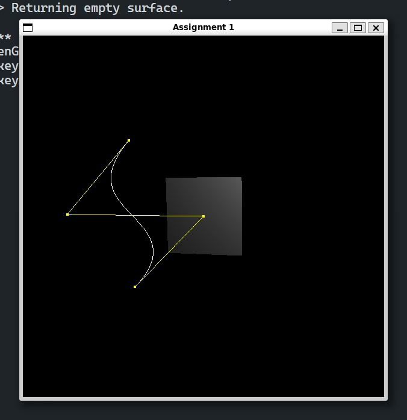

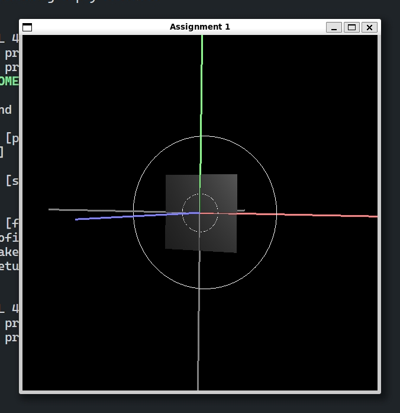

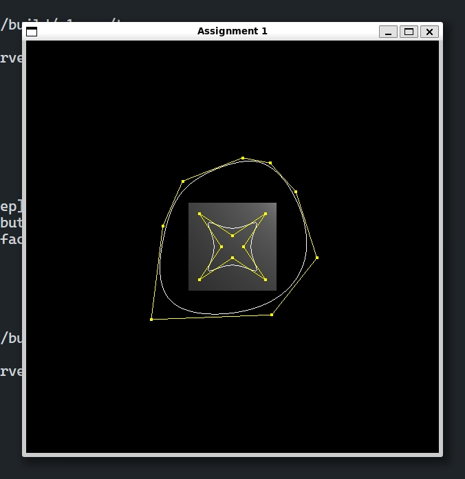

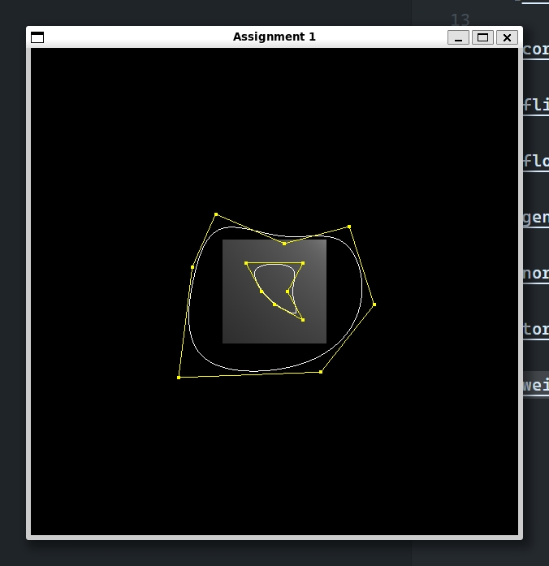

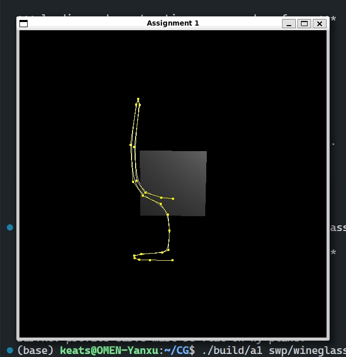

## 任务2：曲面绘制与法线

曲面以三角网格形式输出到 `Surface{VV, VN, VF}`：

- `VV[i]`：顶点坐标
- `VN[i]`：对应顶点法线（用于平滑着色与法线可视化）
- `VF[k] = (i,j,k)`：三角形索引（三角形的三个顶点与三条法线一一对应）

程序提供两种演示方式（按 `S` 切换）：

- 线框/曲面显示（由框架绘制）
- 绘制每个顶点的法线线段（青色）用于检查“法线是否朝外、是否连续”

### 1. 旋转曲面 makeSurfRev（绕 y 轴）

对 profile 曲线上的每个点 $(x,y,0)$，绕 y 轴旋转角度 $\theta$ 得到：

$$
\begin{bmatrix}
x'\\y'\\z'
\end{bmatrix}
=
\begin{bmatrix}
\cos\theta&0&\sin\theta\\
0&1&0\\
-\sin\theta&0&\cos\theta
\end{bmatrix}
\begin{bmatrix}
x\\y\\0
\end{bmatrix}
$$

网格构建：

- 角度方向采样 `steps` 份，并额外复制一圈用于缝合（`steps+1` 个 ring），保证纹理/顶点一致但不产生裂缝。
- ring 与 ring、profile 相邻点之间形成四边形，再拆成两个三角形写入 `VF`。

顶点法线：

- 将 profile 的法向量同样绕 y 轴旋转得到 3D 法线，并单位化。
- 通过与径向向量 $(x',0,z')$ 的点积检查法线方向，必要时翻转，保证“朝外”。

### 2. 广义圆柱面 makeGenCyl（沿 sweep 扫掠 profile）

令 sweep 曲线在每点提供局部正交基 $(N,B,T)$。profile 在 sweep 的法平面内（xy 平面），其点为 $(x,y,0)$。

顶点位置采用“移动坐标系”方式：

$$
V(i,j)=V_\text{sweep}(i)+x\,N(i)+y\,B(i)
$$

顶点法线使用曲面两参数方向切向量叉乘得到：

- profile 方向切向：$S_u = T_{\text{profile},x}N + T_{\text{profile},y}B$
- sweep 方向切向：用有限差分近似 $\partial V/\partial v$，并考虑 frame 随 sweep 的变化：
	$S_v \approx \Delta V + x\,\Delta N + y\,\Delta B$
- 法线：$N_s = \mathrm{normalize}(S_v \times S_u)$

同样通过与 offset（$xN+yB$）点积检查，必要时翻转法线以保证朝外。

闭合处理（避免接缝重叠导致“自交/重叠面”）：

- 若 profile 或 sweep 的首尾点重合（闭合曲线），会去掉最后一个重复点再做网格。
- 连接三角形时对闭合方向使用取模索引，从而形成无裂缝的闭合曲面。

### 3. 曲面相交/自交问题的处理方式

本项目在“旋转/扫掠建模”中最常见的相交类问题主要来自 **接缝重叠与退化面**，会表现为：

- 接缝处重复顶点/重复面片导致 z-fighting（看起来像闪烁/花纹）
- 闭合曲线首尾重复采样导致零面积三角形，进一步引发法线异常与阴影破碎
- 法线在接缝或曲率退化处翻转导致“明暗突然反过来”

对应解决方式：

- 旋转曲面角度方向使用“复制 ring”的方式缝合，但只在相邻 ring 之间生成面片，避免重复面。
- 对闭合 profile/sweep 识别首尾重复点并剔除，再通过取模连接，避免零面积三角形与重叠面。
- 法线方向通过径向/offset 点积强制朝外，并对退化向量使用 `safeNormalized` 回退策略，减少数值问题。

### 4. 结果截图

以下为各样例曲面与法线/着色显示截图：

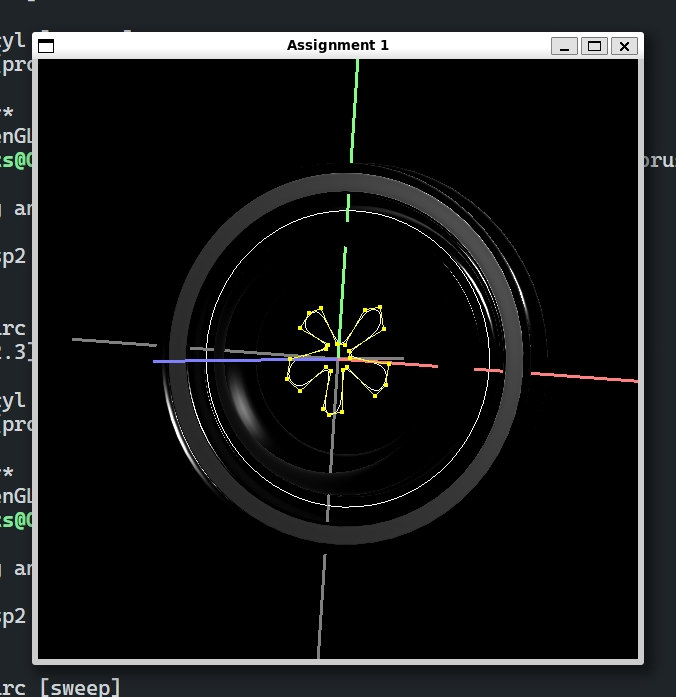

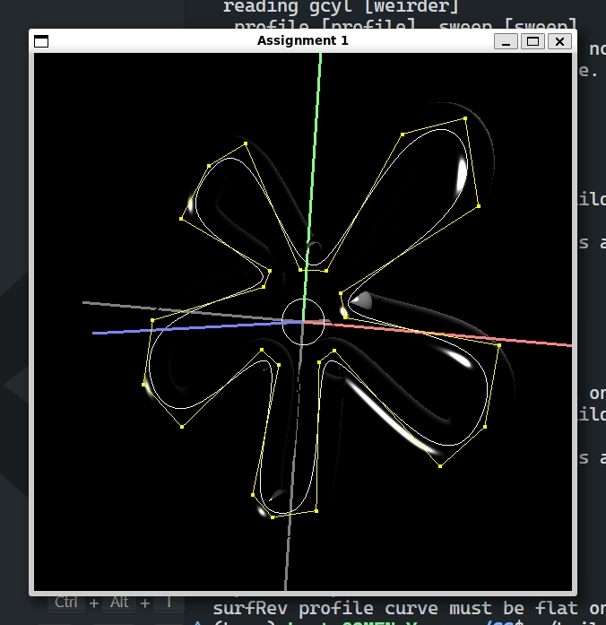

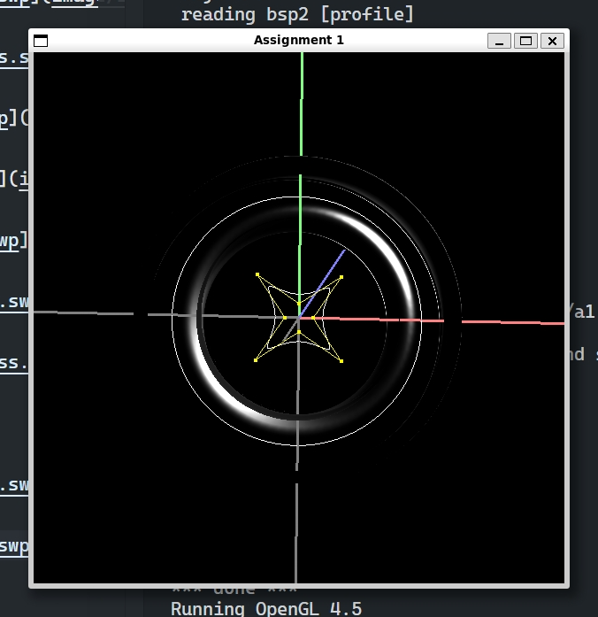

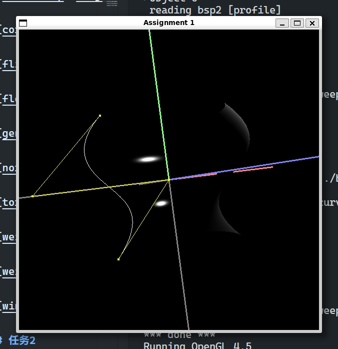

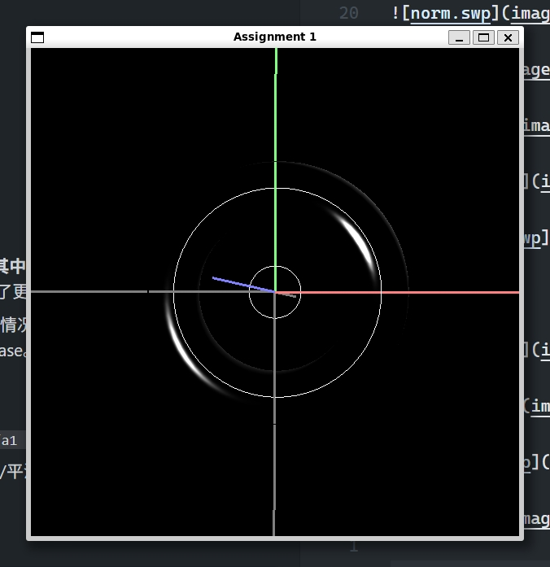

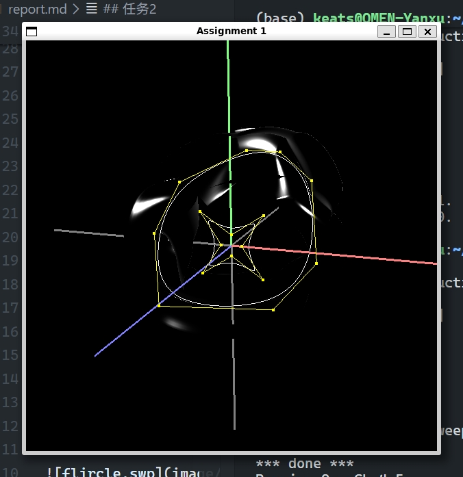

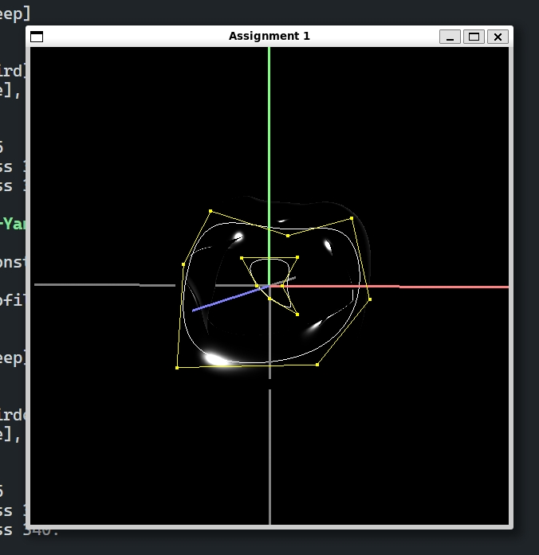

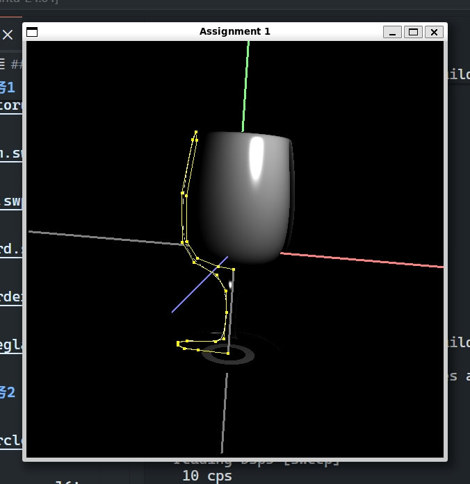